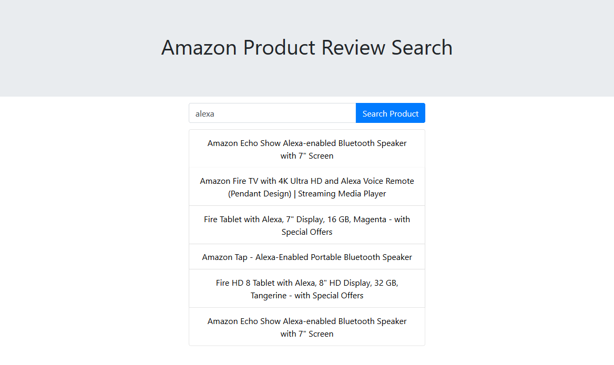
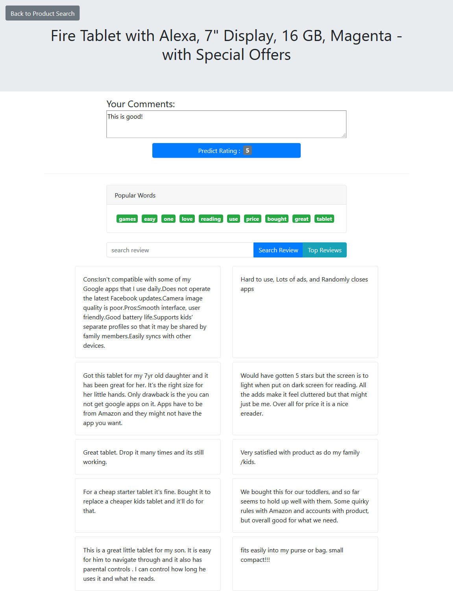

# Introduction
This is a web app for product review search and rating prediction. The review data is from [Kaggle](https://www.kaggle.com/datafiniti/consumer-reviews-of-amazon-products). The source code repository is on [Github](https://github.com/alexalvis/CS525IR)

Product Search Page:

Product Review Page:


# Initial setup for front end
```
cd client-app/
npm install
npm run build
```
If the front-end code is changed, you have to re-run `npm run build` in `client-app/`

# Python Dependency
+ pandas
+ xgboost
+ flask
+ nltk
+ numpy
+ sklearn

# Run The App
on Windows:
```
./run.ps1
```

on Linux/Mac:
```
./run.sh
```